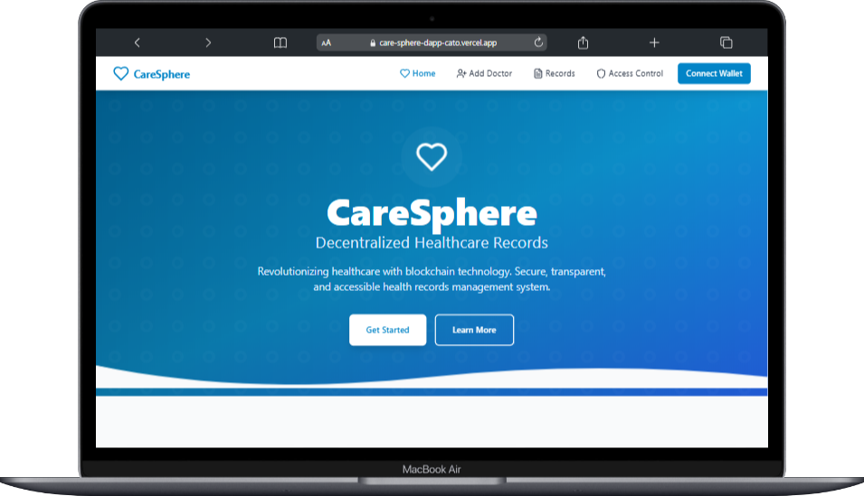
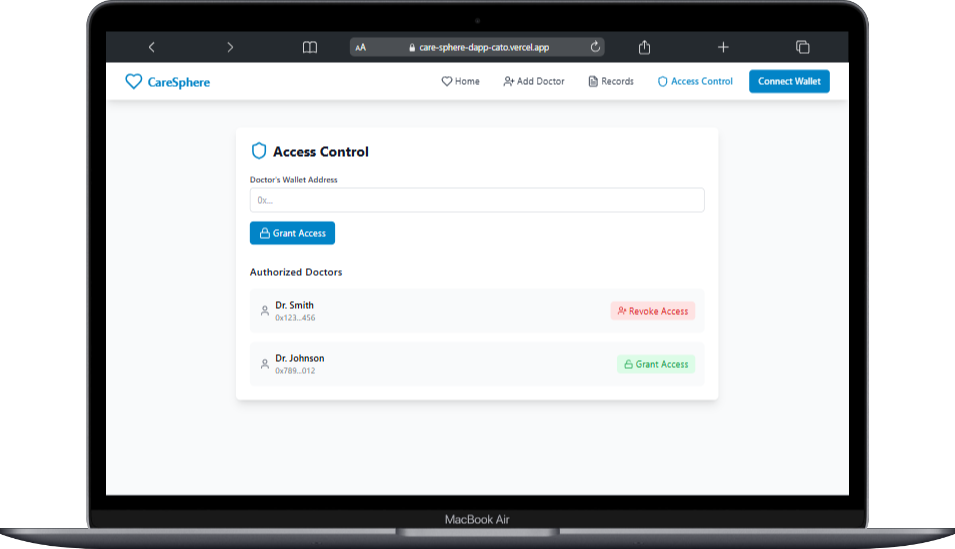

# 🏥 CareSphere - Decentralized Healthcare Records

)

## 🌟 Overview

CareSphere is a revolutionary blockchain-based healthcare records management system that ensures secure, transparent, and accessible medical data handling. Built with React, TypeScript, and Solidity, it provides a seamless interface for managing patient records while maintaining the highest standards of data privacy and security.

## ✨ Features

- 🔐 **Blockchain Security**: Utilizing Solidity smart contracts for secure data management
- 👨‍⚕️ **Doctor Registry**: Comprehensive system for managing healthcare providers
- 📝 **Medical Records**: Secure storage and access of patient medical history
- 🔑 **Access Control**: Granular control over medical record access
- 📱 **Responsive Design**: Seamless experience across all devices
- 🎨 **Modern UI/UX**: Intuitive interface with smooth animations

## 🚀 Getting Started

### Prerequisites

- Node.js (v14.0.0 or later)
- npm or yarn
- MetaMask wallet

### Installation

```bash
# Clone the repository
git clone https://github.com/kigarama/caresphere.git

# Navigate to project directory
cd caresphere

# Install dependencies
npm install

# Start development server
npm run dev
```

## 🛠️ Built With

- ⚛️ **React** - Frontend framework
- 📘 **TypeScript** - Type safety and enhanced developer experience
- 🎨 **Tailwind CSS** - Utility-first CSS framework
- ⛓️ **Solidity** - Smart contract development
- 🔷 **Vite** - Next generation frontend tooling

## 🏗️ Project Structure

```
caresphere/
├── src/
│   ├── components/
│   │   ├── Navbar.tsx
│   │   ├── Hero.tsx
│   │   ├── Footer.tsx
│   │   └── common/
│   ├── pages/
│   │   ├── AddDoctor.tsx
│   │   ├── MedicalRecords.tsx
│   │   └── AccessControl.tsx
│   ├── types/
│   └── App.tsx
├── contracts/
│   └── CareSphere.sol
└── public/
```

## 🔥 Key Features Explained

### Smart Contract Integration
- Secure medical record storage
- Doctor registry management
- Access control mechanisms

### User Interface
- Intuitive navigation
- Responsive design
- Interactive animations
- Modern component architecture

## 🌐 Smart Contract Deployment

```bash
# Deploy to local network
npx hardhat run scripts/deploy.js --network localhost

# Deploy to testnet
npx hardhat run scripts/deploy.js --network goerli
```

## 📸 Screenshots

| Home Page | Doctor Dashboard | Medical Records |
|-----------|-----------------|-----------------|
|  | [Image 2]       | [Image 3]       |

## 🤝 Contributing

1. Fork the Project
2. Create your Feature Branch (`git checkout -b feature/AmazingFeature`)
3. Commit your Changes (`git commit -m 'Add some AmazingFeature'`)
4. Push to the Branch (`git push origin feature/AmazingFeature`)
5. Open a Pull Request

## 📜 License

This project is licensed under the MIT License - see the [LICENSE](LICENSE) file for details.

## 👨‍💻 Developer

<p align="center">
  
</p>

<h3 align="center">Kigarama TSS</h3>
<p align="center">
  <a href="https://github.com/codeWithEdison/careSphere-Dapp.git">
    
  </a>
  <a href="https://linkedin.com/in/kigarama">
    
  </a>
  <a href="https://twitter.com/kigarama">
    
  </a>
</p>

---
<p align="center">
  Made with ❤️ by <a href="https://github.com/kigarama">Kigarama TSS</a>
</p>